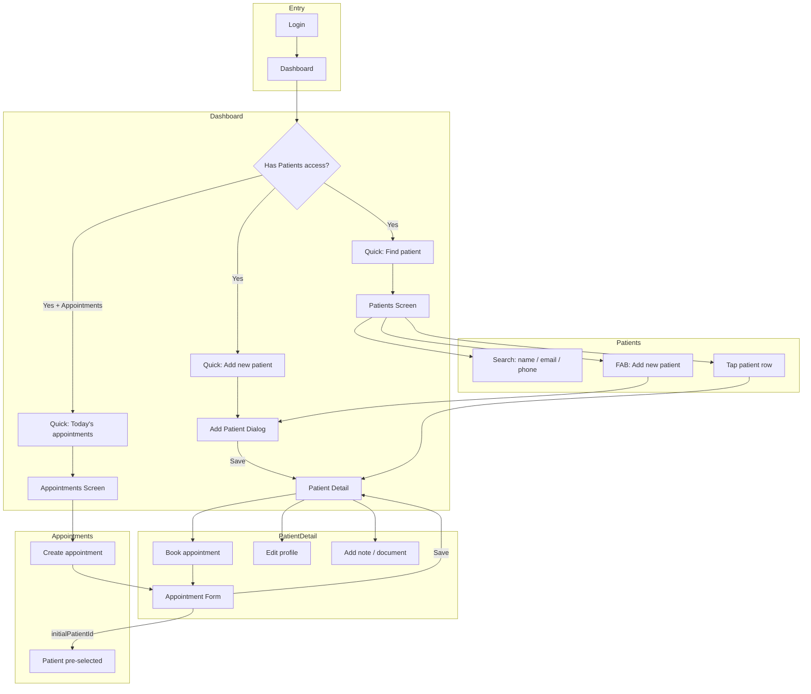

# Phase 1 — UI Flow (Center Team)

This document describes the on-screen flow for secretary, admin, and doctors using the app. Patients do not use the app in this phase.

---

## 1. Entry: Dashboard

After login, the user lands on the **Dashboard**.

- **Header**: App logo, title, language toggle, theme toggle, logout.
- **Drawer**: Role-based menu (Admin, Users, Appointments, Patients, Reports, etc.).
- **Body**:
  - Welcome + role label.
  - **Quick actions** (only if user has **Patients** access):
    - **Add new patient** → Opens Add Patient dialog → on save, navigates to **Patient detail**.
    - **Find patient** → Navigates to **Patients** screen.
    - **Today's appointments** (if user has **Appointments** access) → Navigates to **Appointments** screen.
  - **Today's appointments** card → Link to **My Appointments** or **Appointments** depending on role.

```
┌─────────────────────────────────────────┐
│  Dashboard                              │
├─────────────────────────────────────────┤
│  Welcome, [Name]                        │
│  Role: Secretary                        │
│                                         │
│  [Add new patient] [Find patient]       │
│  [Today's appointments]                 │
│                                         │
│  ┌─ Today's appointments ─────────────┐ │
│  │  • Appointment 1                  │ │
│  │  • Appointment 2                  │ │
│  │  [Appointments]                   │ │
│  └───────────────────────────────────┘ │
└─────────────────────────────────────────┘
```

---

## 2. Add New Patient Flow

**Trigger**: Dashboard quick action **Add new patient** or **Patients** screen FAB **Add new patient**.

1. **Add Patient dialog** opens (modal).
   - **Fields**: Full name (Arabic), Full name (English), Phone, Email (optional), Date of birth (optional), Gender (optional).
   - At least one name (AR or EN) required.
   - **Actions**: Cancel | Save.
2. On **Save**:
   - Creates user (role: patient) + patient profile in Firestore.
   - Dialog closes and returns the new patient id.
3. App **navigates to Patient detail** for that patient (`/patients/{id}`).

```
Dashboard or Patients
        │
        ▼
┌─────────────────────────────────────────┐
│  Add new patient                        │
├─────────────────────────────────────────┤
│  Full name (Arabic) *                    │
│  Full name (English) (optional)          │
│  Phone                                  │
│  Email (optional)                        │
│  Date of birth (optional)                │
│  Gender (optional)                       │
│                                         │
│            [Cancel]  [Save]              │
└─────────────────────────────────────────┘
        │ Save
        ▼
   Patient detail (new patient)
```

---

## 3. Patients Screen

**Entry**: Drawer → **Patients**, or Dashboard → **Find patient**.

- **App bar**: Title "Patients", back, notifications.
- **Search bar**: Search by **name**, **email**, or **phone** (partial, case-insensitive). List updates as user types.
- **List**: All patients (users with role patient). Each row: name, email. Tap row → **Patient detail** (`/patients/{id}`).
- **FAB** (if user has Patients access): **Add new patient** → same Add Patient dialog → on save, navigate to new **Patient detail**.

```
┌─────────────────────────────────────────┐
│  ←  Patients                    [🔔]    │
├─────────────────────────────────────────┤
│  [🔍 Search...]                         │
├─────────────────────────────────────────┤
│  ┌─────────────────────────────────────┐│
│  │  Patient A        patient@mail.com   ││  ──► Patient detail (A)
│  └─────────────────────────────────────┘│
│  ┌─────────────────────────────────────┐│
│  │  Patient B        patient2@mail.com  ││  ──► Patient detail (B)
│  └─────────────────────────────────────┘│
│                                         │
│                          [➕ Add new patient]
└─────────────────────────────────────────┘
```

---

## 4. Patient Detail Screen

**Entry**: From **Patients** list (tap row), or after **Add new patient** (auto-navigate).

- **App bar**: "Patient detail", back (→ Patients or Dashboard), edit profile (if user can edit).
- **Body**:
  - **Profile card**: Name, email, phone, DOB, diagnosis, medical history, treatment progress, notes (from patient profile).
  - **Book appointment** button (if user has Appointments access) → Opens **Appointment form** with this patient pre-selected; on save, list refreshes.
  - **Sessions**: Merged list (sessions + confirmed/completed appointments), sorted by date.
  - **Documents**: List of notes/images/PDFs. **Add note** opens document/note dialog in context of this patient.

```
┌─────────────────────────────────────────┐
│  ←  Patient detail              [✏️]     │
├─────────────────────────────────────────┤
│  ┌─ Profile ───────────────────────────┐│
│  │  Name, email, phone, DOB, etc.       ││
│  └─────────────────────────────────────┘│
│                                         │
│  [📅 Book appointment]                  │
│                                         │
│  Sessions                               │
│  ┌─────────────────────────────────────┐│
│  │  Date • Time • Service • Status      ││
│  └─────────────────────────────────────┘│
│                                         │
│  Documents              [+ Notes]       │
│  ┌─────────────────────────────────────┐│
│  │  Note / PDF / Image                  ││
│  └─────────────────────────────────────┘│
└─────────────────────────────────────────┘
```

---

## 5. Appointments Screen & Create Appointment

**Entry**: Drawer → **Appointments**, or Dashboard → **Today's appointments**, or from **Patient detail** → **Book appointment** (opens form only).

- **Appointments screen**: List of appointments (filter by status, search by patient/doctor/service). **Create** opens **Appointment form**.
- **Appointment form** (dialog):
  - **Patient**: Search field + dropdown. Search filters by name, email, phone. If opened from Patient detail, patient is pre-selected.
  - Doctor, Room, Date, Start/End time, Service, Amount, Notes.
  - Save → Appointment created; if opened from Patient detail, that screen refreshes.

```
Appointments screen
        │
        ▼
┌─────────────────────────────────────────┐
│  Create appointment                     │
├─────────────────────────────────────────┤
│  Patient                                │
│  [🔍 Search...]                         │
│  [Dropdown: filtered patients]          │
│  Doctor      [Dropdown]                 │
│  Room        [Dropdown]                 │
│  Date        [Tap to pick]              │
│  Time start  [Dropdown]  Time end [▼]   │
│  Service     [________________]         │
│  Amount      [________________]         │
│  Notes       [________________]         │
│                                         │
│            [Cancel]  [Save]              │
└─────────────────────────────────────────┘
```

---

## 6. Flow Summary (Mermaid)



---

## 7. Screen → Route Mapping

| Screen / Action        | Route / Behavior                    |
|------------------------|-------------------------------------|
| Dashboard              | `/dashboard`                        |
| Patients list          | `/patients`                         |
| Patient detail         | `/patients/:id`                     |
| Add new patient (dialog)| Modal; then push `/patients/:id`   |
| Appointments            | `/appointments`                    |
| Book appointment       | Modal (Appointment form)           |
| Find patient           | Push `/patients`                   |
| Today's appointments   | Push `/appointments`                |

This flow covers the phase 1 center-team usage only; patient-facing flows (register, my appointments, self-booking) are unchanged and not used by patients in this phase.
